# FAME + TSDM experiment report

- Sequence: `seq=0`
- Seeds: `[1]`
- Detection tolerance: `2000` steps
- Post-hoc evaluation: **no**
- Runs discovered: `{'oracle': 1, 'swoks': 1, 'implicit': 1, 'hybrid': 1}`

## Main results

| mode | n_seeds | avg_perf_proxy | avg_perf_posthoc | forward_transfer | forgetting_norm | det_F1 | det_delay | tp_fp_fn |
|---|---|---|---|---|---|---|---|---|
| oracle | 1 | 1.35 +/- 0.00 | - | 0.000 +/- 0.000 | -0.500 | - | - | - |
| swoks | 1 | 0.93 +/- 0.00 | - | -0.046 +/- 0.000 | -0.227 | 1.00 +/- 0.00 | 599 +/- 0 | 2/0/0 |
| implicit | 1 | 1.54 +/- 0.00 | - | -0.165 +/- 0.000 | -1.736 | 0.14 +/- 0.00 | 1449 +/- 0 | 1/10/2 |
| hybrid | 1 | 0.76 +/- 0.00 | - | -0.028 +/- 0.000 | -0.945 | 0.50 +/- 0.00 | 274 +/- 0 | 2/3/1 |

## Visualisations
### Learning curves (mean +/- SE)
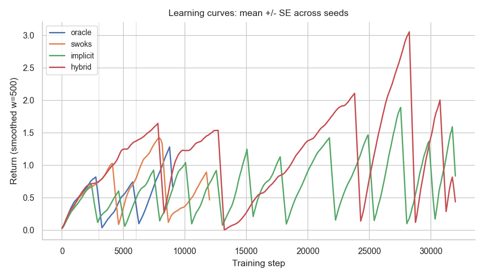

### Detection timeline vs oracle
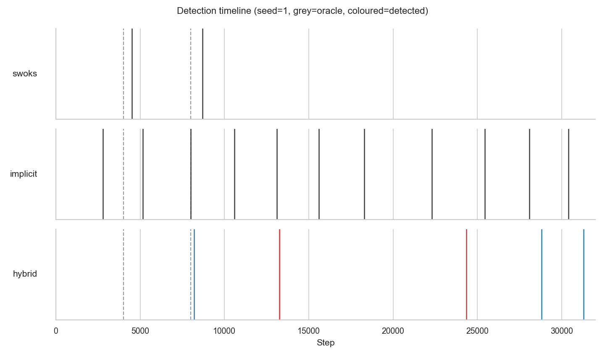

### Distribution of TP detection delays
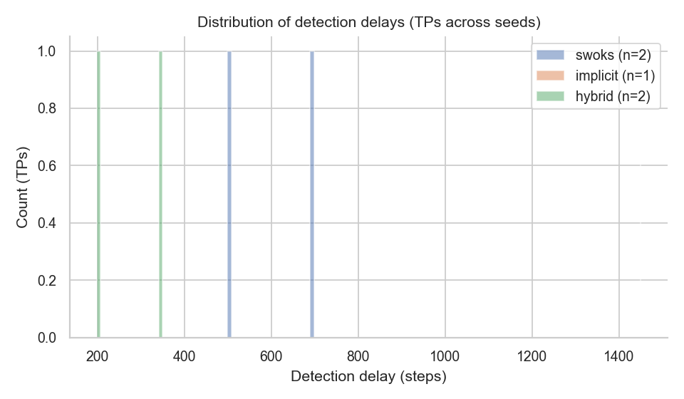

### Detection quality per mode
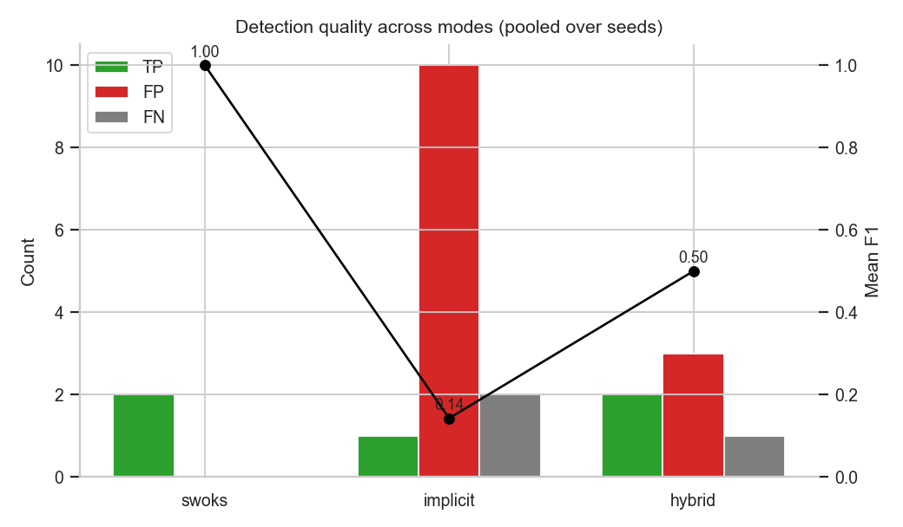

### Per-task AUC
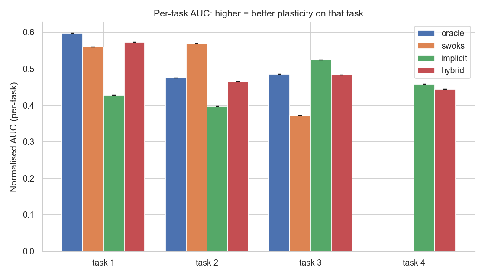

### Forgetting heatmap
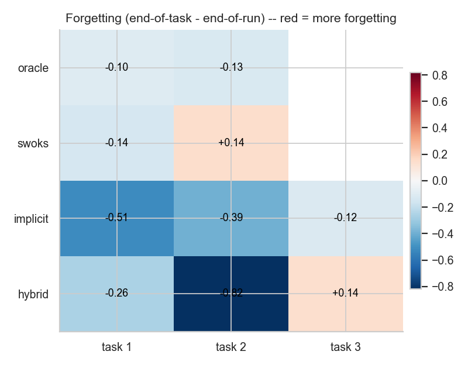

### Adaptive warm-up selection ratio
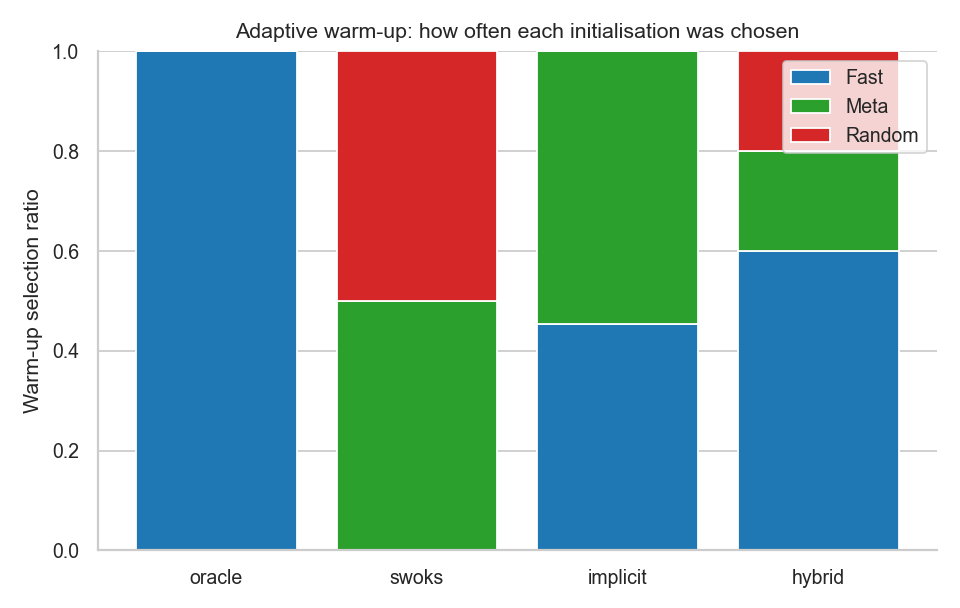

### Hybrid firing-reason distribution
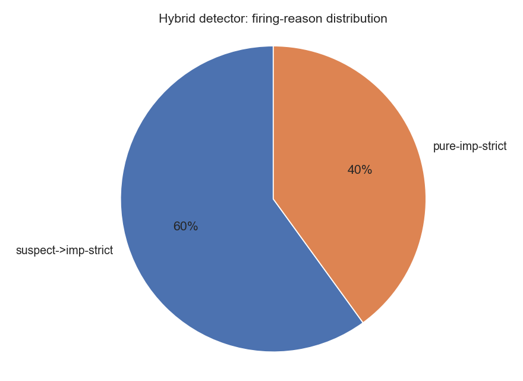

### Avg-perf ratio to oracle ceiling
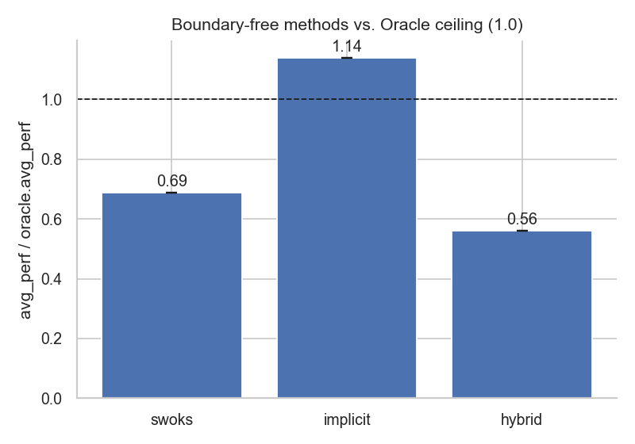

### F1 vs detection tolerance
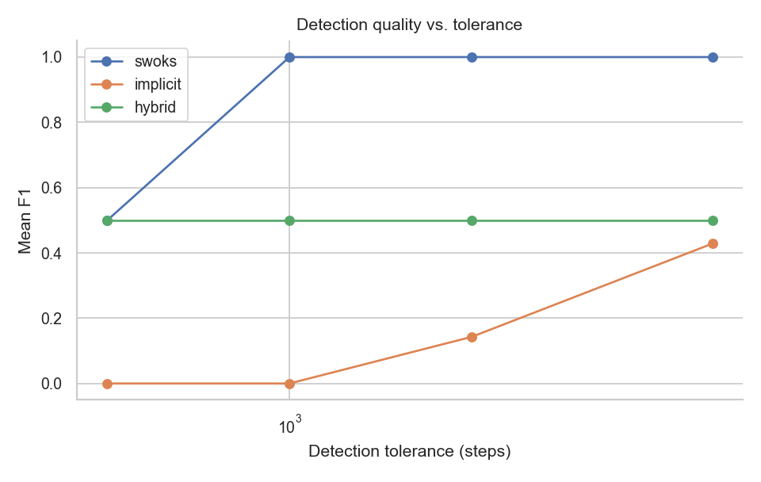

### Hybrid vs implicit overlay
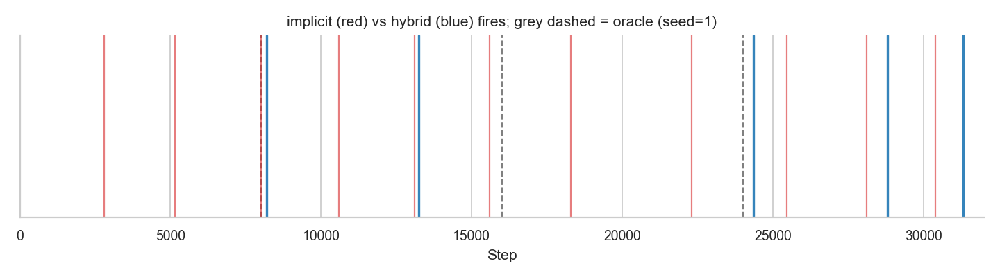

### SWOKS p-value trace
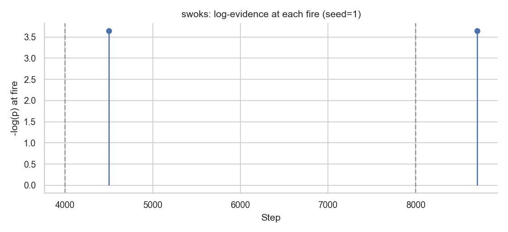

### Implicit p-value trace
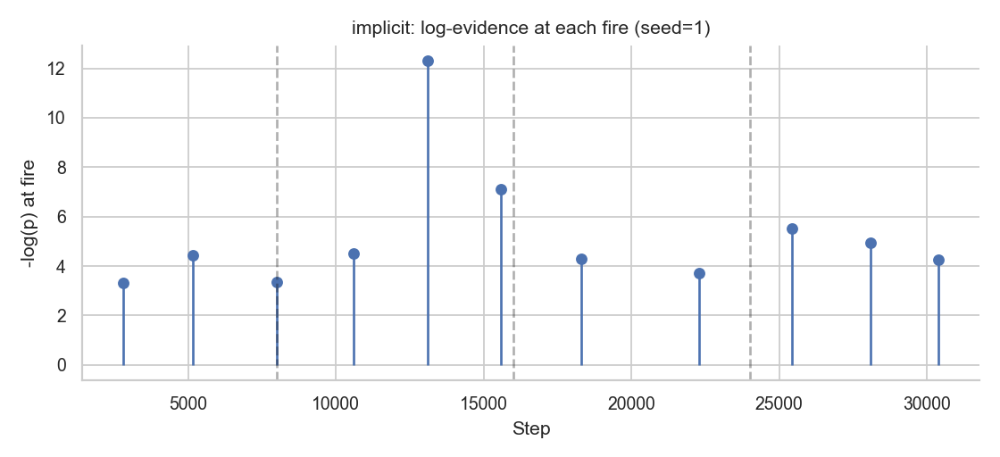

## Notes on metrics

- **AvgPerf (proxy)** is the mean return over the last 2% of the training trace.  Fast to compute, noisy on short runs.
- **AvgPerf (posthoc)** loads the final *meta* learner and rolls it for N episodes in each of {breakout, space_invaders, freeway}; averaged across games.  Matches the FAME paper's $(1/K)\sum_i p_i(K\cdot T)$ exactly.
- **Forward Transfer** compares per-task AUC against the baseline mode (Oracle by default, standing in for Reset).
- **Forgetting** is the per-task end-of-task minus end-of-run training-trace mean, then normalised by the cross-method standard deviation per task (as in the paper).
- **Detection F1** uses greedy 1-to-1 matching of detected boundaries to oracle switches within `tolerance` steps.
