# FAME + TSDM experiment report

- Sequence: `seq=0`
- Seeds: `[1]`
- Detection tolerance: `60000` steps
- Post-hoc evaluation: **no**
- Runs discovered: `{'oracle': 1, 'swoks': 1, 'implicit': 1, 'hybrid': 1}`

## Main results

| mode | n_seeds | avg_perf_proxy | avg_perf_per_game | avg_retention | avg_perf_posthoc | forward_transfer | forgetting_norm | det_F1 | det_delay | tp_fp_fn |
|---|---|---|---|---|---|---|---|---|---|---|
| oracle | 1 | 11.94 +/- 0.00 | 18.32 +/- 0.00 | 1.000 +/- 0.000 | - | 0.000 +/- 0.000 | +1.260 | - | - | - |
| swoks | 1 | 9.17 +/- 0.00 | 23.23 +/- 0.00 | 1.000 +/- 0.000 | - | -0.865 +/- 0.000 | +2.136 | 0.91 +/- 0.00 | 4983 +/- 0 | 5/0/1 |
| implicit | 1 | 5.02 +/- 0.00 | 15.41 +/- 0.00 | 0.742 +/- 0.000 | - | -0.997 +/- 0.000 | +2.814 | 0.12 +/- 0.00 | 20939 +/- 0 | 4/56/2 |
| hybrid | 1 | 5.50 +/- 0.00 | 16.33 +/- 0.00 | 0.819 +/- 0.000 | - | -1.148 +/- 0.000 | +2.787 | 0.22 +/- 0.00 | 13010 +/- 0 | 4/26/2 |

## Visualisations
### Learning curves (mean +/- SE)
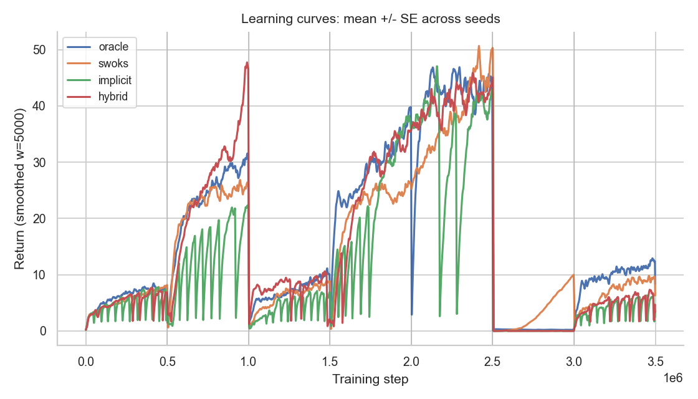

### Detection timeline vs oracle
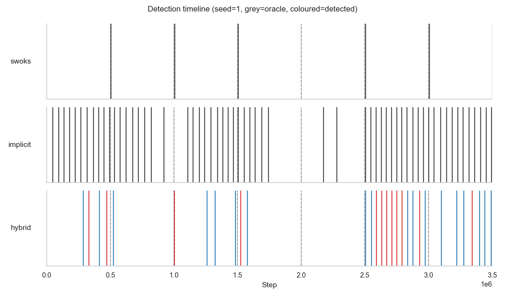

### Distribution of TP detection delays
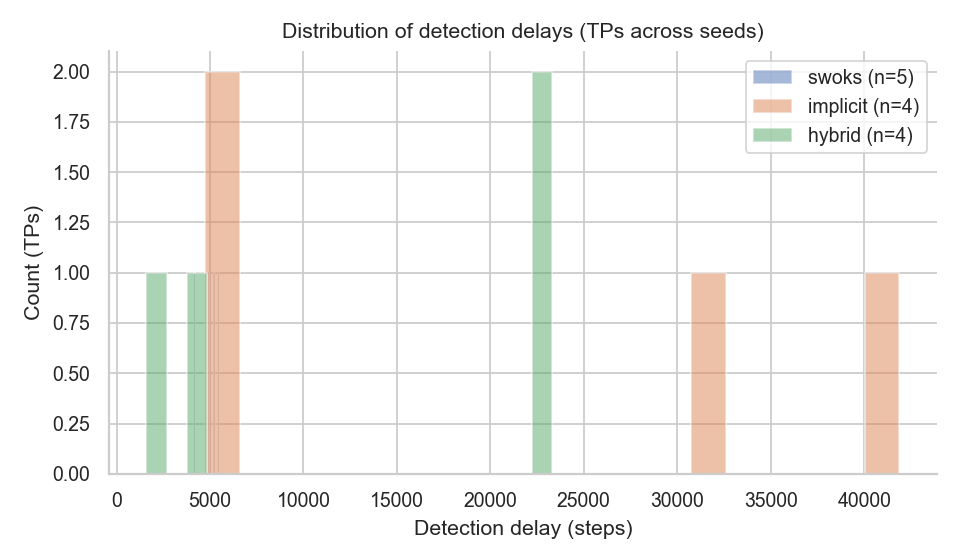

### Detection quality per mode
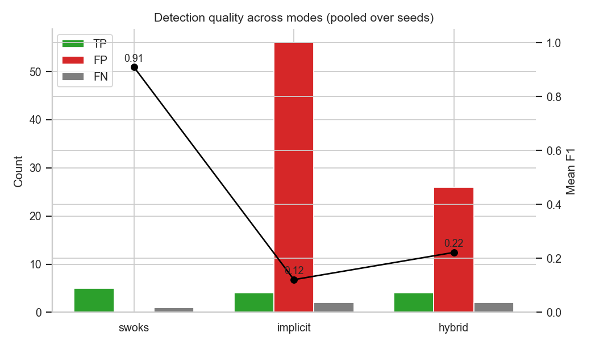

### Per-task AUC
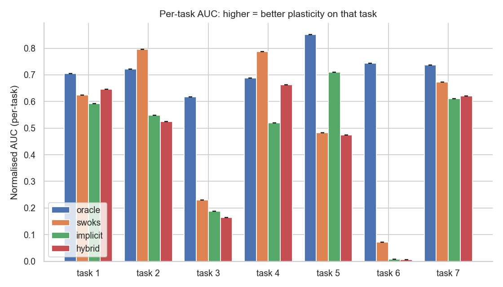

### Forgetting heatmap
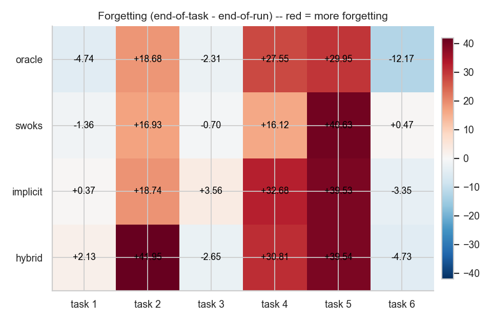

### Adaptive warm-up selection ratio
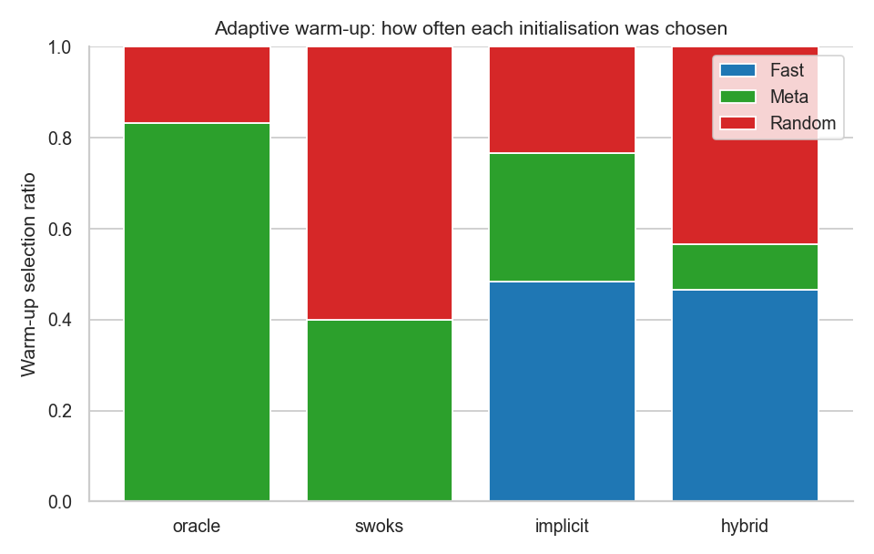

### Hybrid firing-reason distribution

### Avg-perf ratio to oracle ceiling
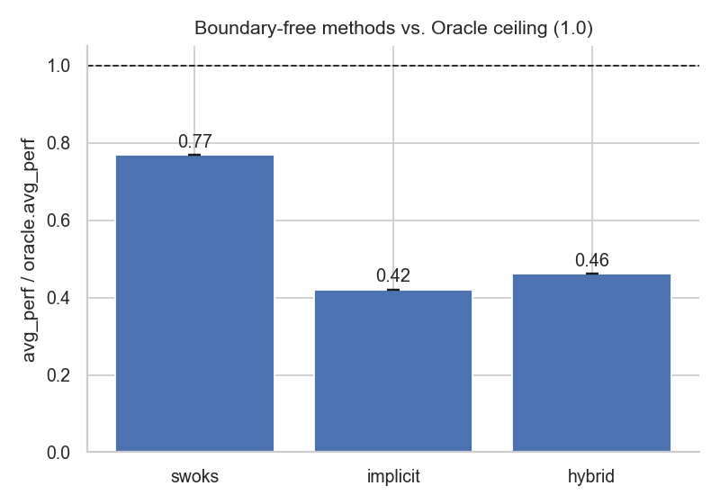

### F1 vs detection tolerance
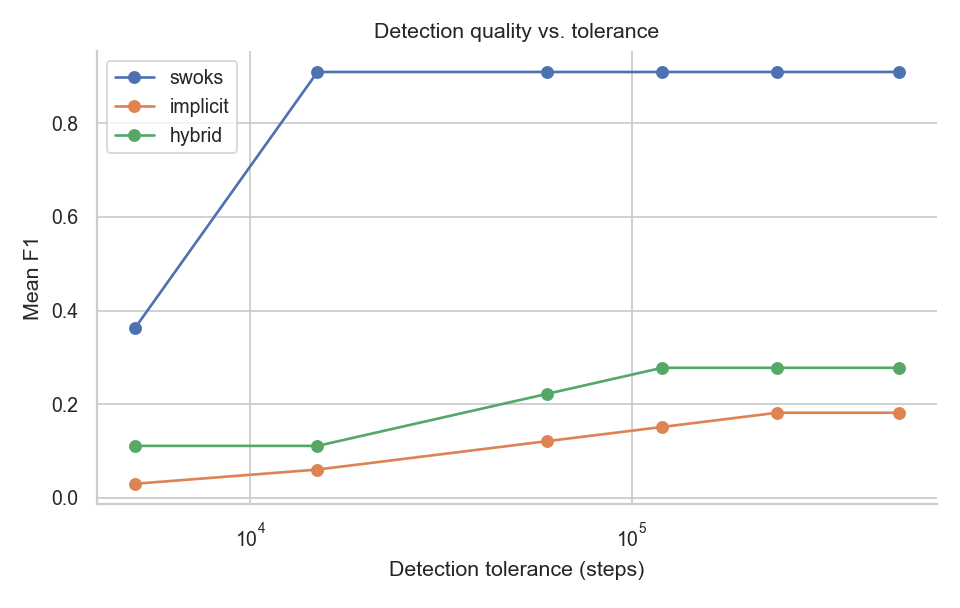

### Hybrid vs implicit overlay
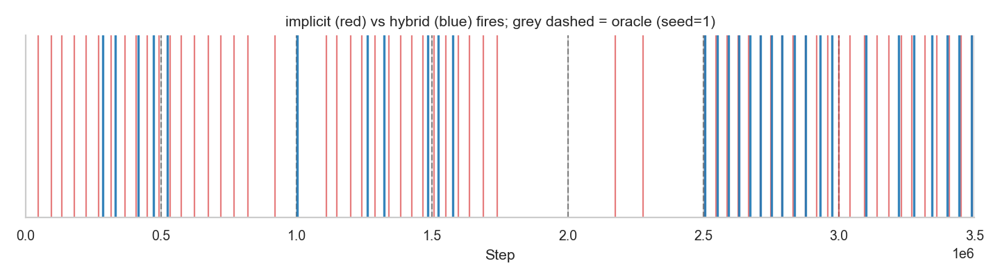

### SWOKS p-value trace
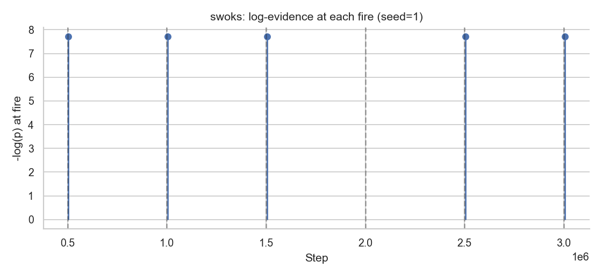

### Implicit p-value trace
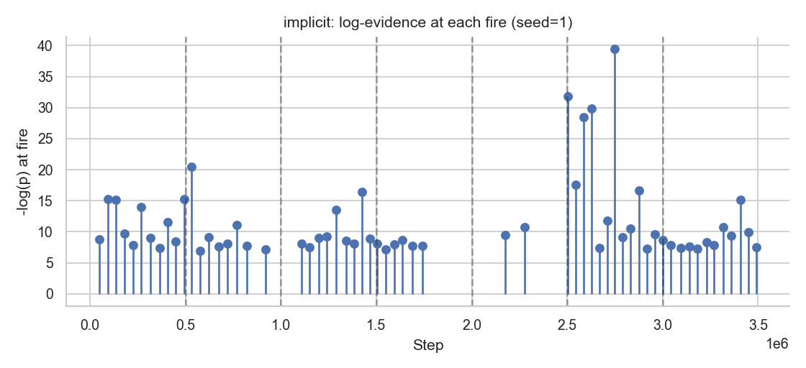

## Notes on metrics

- **AvgPerf (proxy)** is the mean return over the last 2% of the training trace.  KNOWN PROBLEM: this only sees the final task in the sequence (e.g. for seq=0 only the last 70k steps of breakout).  It rewards methods that happen to be good at whatever the last game is, not continual-learning ability per se.  Reported for FAME-paper comparability.
- **AvgPerf (per_game)** is a fairer training-trace proxy: for each unique game in the sequence, take the mean return in the last 5000 steps of that game's most recent task. Then average across games.  Equally weights every game regardless of how often or where it appears in the sequence.  Higher = better.
- **Avg Retention** is the mean across games of (last_window / peak_window) where peak is the max end-of-task window across all occurrences of that game. Bounded ~[0, 1].  Replaces the FAME forgetting metric with one that doesn't penalise methods for learning more: a method that learnt a peak of 50 and lost down to 25 has the same retention (0.5) as one that peaked at 10 and lost down to 5.
- **AvgPerf (posthoc)** loads the final *meta* learner and rolls it for N episodes in each of {breakout, space_invaders, freeway}; averaged across games.  Matches the FAME paper's $(1/K)\sum_i p_i(K\cdot T)$ exactly.  This is the gold standard when MetaFinal.pt weights are available.
- **Forward Transfer** compares per-task AUC against the baseline mode (Oracle by default, standing in for Reset).
- **Forgetting (norm)** is the FAME paper's metric: per-task (end-of-task - end-of-run), normalised by the cross-method std per task.  KNOWN PROBLEM: the end-of-run window is on whatever game is *last*, while end-of-task is on a potentially different game.  Reported for paper comparability; prefer Avg Retention.
- **Detection F1** uses greedy 1-to-1 matching of detected boundaries to oracle switches within `tolerance` steps.
